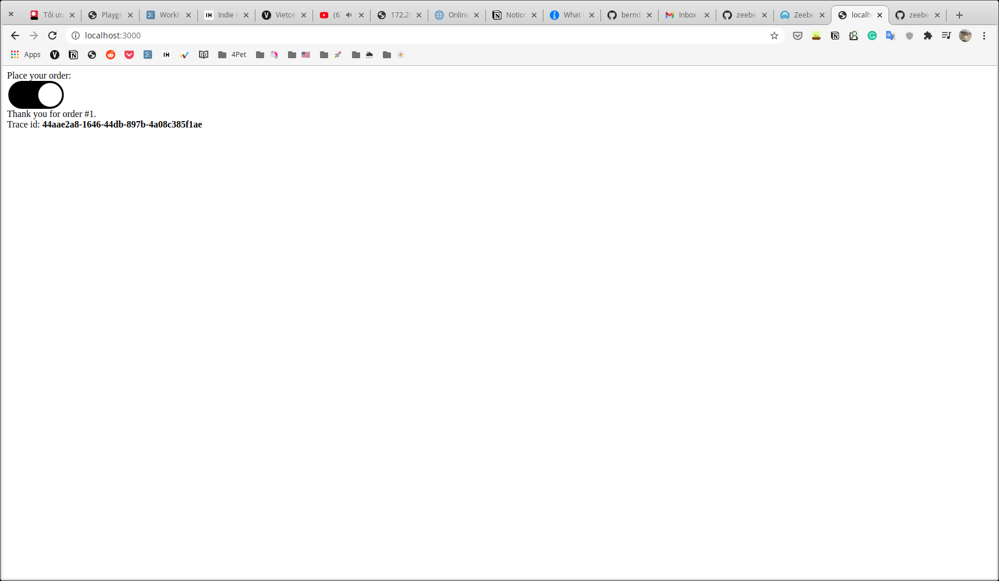
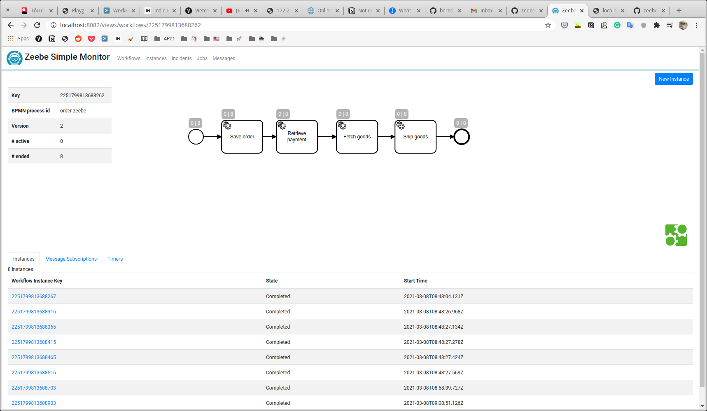

# zeebe-example

The simple example about Zeebe.
*From https://github.com/berndruecker/flowing-retail*

## What is Zeebe?

Zeebe is a workflow engine for microservices orchestration.

https://zeebe.io/what-is-zeebe/

## Download Zeebe Modeler

https://github.com/zeebe-io/zeebe-modeler

## Start Zeebe Broker & Zeebe Monitor

```sh
docker-compose up -d
```

## Open http://localhost:3000/ & http://localhost:8082/





## Learn how to use Zeebe

https://docs.camunda.io/docs/product-manuals/zeebe/deployment-guide/getting-started/index
